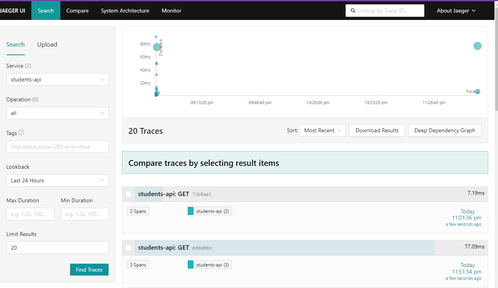
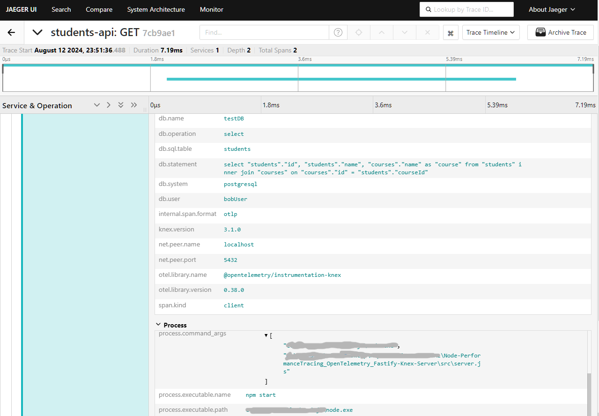

# Node-PerformanceTracing_OpenTelemetry_Fastify-Knex-Server

Monitoramento de Performance de Aplicativos Node.js. Implementação de monitoramento utilizando OpenTelemetry e Jaeger para instrumentação de APIs com Fastify e consultas com Knex, executando em um ambiente Docker para medição precisa de desempenho e análise de status codes retornados.

<h1 align="center">
  Node.js API com Monitoramento de Performance usando OpenTelemetry
</h1>
<p align="center">
  <a href="#about">Sobre</a>&nbsp;&nbsp;&nbsp;|&nbsp;&nbsp;&nbsp;
  <a href="#features">Features</a>&nbsp;&nbsp;&nbsp;|&nbsp;&nbsp;&nbsp;
  <a href="#technologies">Tecnologias</a>&nbsp;&nbsp;&nbsp;|&nbsp;&nbsp;&nbsp;
  <a href="#installation">Instalação</a>&nbsp;&nbsp;&nbsp;|&nbsp;&nbsp;&nbsp;
  <a href="#learned">O que eu aprendi?</a>&nbsp;&nbsp;&nbsp;|&nbsp;&nbsp;&nbsp;
  <a href="#author">Autor</a>
</p>

---

<p align="center">
  
  
</p>

---

<h2 id="about" align="center">📌 Sobre </h2>

Implementação de uma API desenvolvida em Node.js usando Fastify, integrada com OpenTelemetry para monitorar a performance de operações HTTP e consultas a um banco de dados PostgreSQL via Knex. Toda a instrumentação de performance é coletada e exportada para o Jaeger em um ambiente Docker, permitindo análises detalhadas sem custo adicional.<br>

> Também foi adicionado comentarios em todos em diversos arquivos do código, que devem ajudar a manter a clareza das funcionalidades, facilitando o uso e a aprendizado do projeto no futuro.

<h2 id="features" align="center">⚙️ Features</h2>

- **Monitoramento de Performance com OpenTelemetry:** A aplicação é totalmente instrumentada para capturar métricas de performance detalhadas em cada requisição HTTP e interação com o banco de dados, usando OpenTelemetry.

- **Exportação de Traces para o Jaeger:** Os traces coletados são exportados para o Jaeger, permitindo uma análise visual e detalhada das operações da API, desde a recepção de uma requisição até a consulta ao banco de dados.

- **Integração com Fastify:** Utilização do framework Fastify para criar uma API performática, que aproveita as capacidades de monitoramento do OpenTelemetry.

- **Consultas Otimizadas com Knex:** A API executa queries ao banco de dados PostgreSQL via Knex, com instrumentação para rastrear o desempenho de cada consulta.

- **Ambiente Dockerizado:** Toda a aplicação, incluindo OpenTelemetry Collector, Jaeger, e PostgreSQL, é executada em contêineres Docker, simplificando o processo de configuração e execução.

<h2 id="technologies" align="center">💻 Tecnologias</h2>
Neste projeto foram utilizadas as seguintes tecnologias:

- **Node.js** - Plataforma utilizada para criar a API e integrar a instrumentação de performance.
- **Fastify** - Framework web rápido e leve para Node.js, ideal para aplicações que necessitam de alta performance.
- **Knex** - Query builder SQL utilizado para interagir com o banco de dados PostgreSQL.
- **PostgreSQL** - Banco de dados relacional escolhido.
- **OpenTelemetry** - Framework de código aberto para observabilidade, utilizado para instrumentar e monitorar a aplicação.
- **Jaeger** - Ferramenta para análise de traces, usada para visualizar os dados coletados pelo OpenTelemetry.
- **Docker** - Utilizado para criar e gerenciar o ambiente de desenvolvimento em contêineres, garantindo consistência e facilidade de uso.

<h2 id="installation" align="center">📦 Instalação</h2>
Para inicializar, faça o fork deste repositório e siga os passos abaixo:

Instalar as Dependências:

```sh
npm install
```

Inicializar o Ambiente Docker:

```sh
docker compose up -d
```

Verificar se todos os serviços estão ativos:

```sh
docker ps
```

Inicializar o Servidor Fastify:

```sh
npm start
```

Acessar a Interface do Jaeger:
`Navegue até http://localhost:8081/search para visualizar os traces.`

Testar a Rota /students:
`Use uma ferramenta como cURL ou Postman para enviar uma requisição GET para http://localhost:8080/students.`

<h2 id="learned" align="center">☕ O que eu aprendi?</h2>

> Este projeto me proporcionou uma compreensão mais profunda sobre como monitorar a performance de uma aplicação Node.js usando OpenTelemetry.
> Aprendi como configurar e utilizar o OpenTelemetry Collector em conjunto com o Jaeger para capturar e visualizar métricas detalhadas de performance com facilidade.<br>
> Também aprofundei meus conhecimentos em Docker, orquestrando múltiplos serviços (API, banco de dados, coletor de telemetria) em contêineres, garantindo um ambiente de desenvolvimento consistente e fácil de configurar.<br>
> Além disso, tive a oportunidade de ser introduzido a consultas SQL com Knex e conhecer o framework Fastify.<br>
> Este projeto reforçou a importância de uma boa observabilidade na manutenção e otimização de sistemas complexos, algo crucial para a estabilidade e performance de aplicações em produção.<br>

<h2 id="author" align="center">Autor</h2>
Feito com 💜 e dedicação por Guilherme G Cadilhe Aka: Bobnini. <br>

<h2 id="thanks" align="center">Agradecimentos</h2>
- As lições em vídeo de Erick Wendel, um grande representante brasileiro em NodeJS e Javascript
